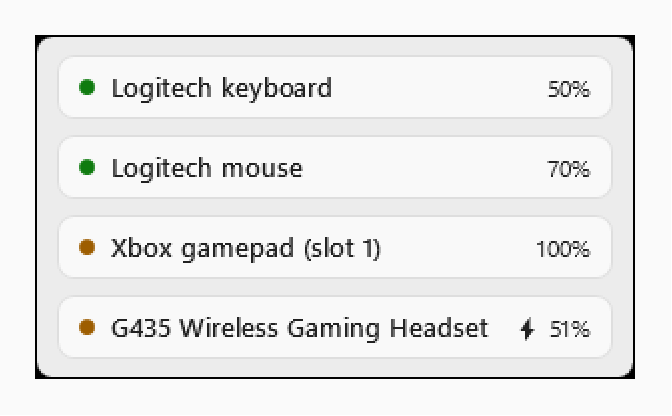
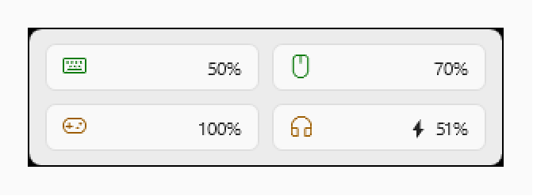
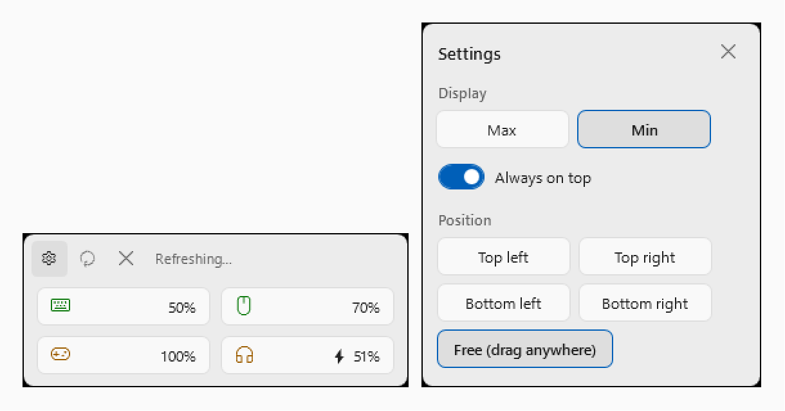
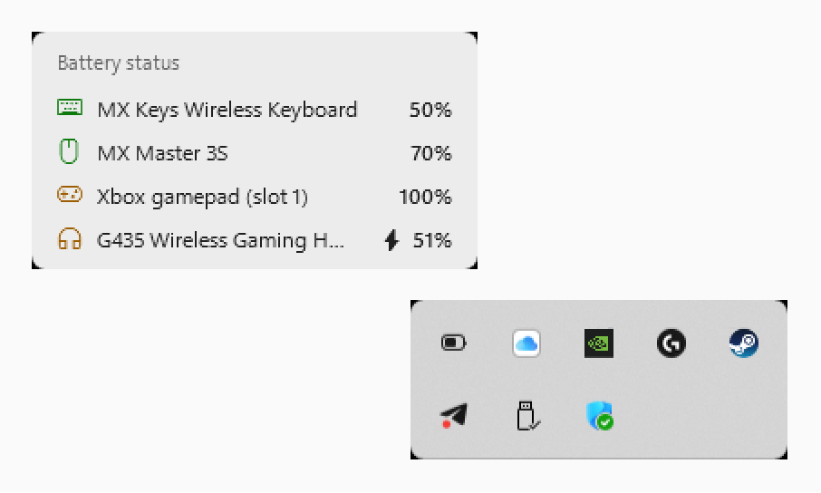

# GearHub

A lightweight Windows widget that keeps an eye on your gear: battery level and connection status
for gamepads, keyboards, mice and headsets — regardless of how they are connected.

| Full mode | Compact mode |
| --- | --- |
|  |  |

| Settings popover | Tray flyout |
| --- | --- |
|  |  |

## Support the project

GearHub is free and open source. If it is useful to you:

- ⭐ **Star the repository** — it helps other people find GearHub.
- ☕ **[DonationAlerts](https://www.donationalerts.com/r/cyrilstrone)** — a one-time donation keeps the project alive.

Ideas are worth as much as donations: found a bug or want your device supported — an [issue](https://github.com/jenesei-software/gearhub/issues) is the best kind of help.

## License

Released under the [MIT License](LICENSE).

## Features

- **Xbox gamepads** (XInput): charge level (empty/low/medium/full) and power source (USB / AA batteries / rechargeable battery).
- **Bluetooth LE devices** with the Battery Service (`GATT 0x180F`): exact percentage.
- **Logitech Lightspeed headsets (G435)**: over the Lightspeed dongle the widget shows the connection
  and the charging state (⚡) — Logitech does not broadcast the percentage there (the frames contain
  counters only — verified by capture). Over Bluetooth the widget shows the **real battery
  percentage**: Windows receives it from the headset via the Hands-Free profile, and GearHub reads
  it as a device property (`DEVPKEY_Device_BatteryLevel`).
- **Logitech via HID++**: devices behind Unifying/Bolt receivers are found through the receiver's
  connection notifications (sub_id `0x41`) and an active slot ping scan. The exact percentage and real name
  (`MX Keys`, `MX Master 3S`, …) are read with HID++ 2.0 requests over the receiver's long channel
  (usage `0xFF00/0x0002`, `0x11` frames): `0x1004` (UNIFIED_BATTERY) → `0x1000` (BATTERY_STATUS) →
  `0x1001` (BATTERY_VOLTAGE) → HID++ 1.0 fallback (registers `0x0D`/`0x07`) for older devices.
  A sleeping device is detected by ping and clearly marked "device is asleep". Works alongside
  G HUB and Logi Options+.
- **Native Windows 11 look**: light/dark theme follows the system setting and switches on the fly; system
  Fluent colors and the Segoe UI Variable font; the tray icon is a monochrome Windows-style battery —
  white on a dark taskbar, dark on a light one.
- **Localization**: the UI matches the Windows display language — English, Russian, German, French,
  Spanish or Chinese (Simplified); any other language falls back to English. For testing, override it:
  `$env:GEARHUB_LANG = "en"` before launch.
- **Device states:** 🟢 connected (green), 🟡 recently offline (default < 6 h) or a battery read error
  (yellow), 🔴 long offline (red).
- **History**: "last seen" persists between runs (`%APPDATA%\GearHub\state.json`).
- **Settings (⚙ button)**: display mode "Max" (cards with the device name and percentage) / "Min"
  (two-column tiles with a device glyph and percentage), an "always on top" toggle and screen position
  (four corners or free placement with a remembered position). The settings window behaves like a
  smart popover: it follows the bar and flips to the other side when there is no room.
  Settings live in `%APPDATA%\GearHub\settings.json`.
- **Tray icon with three behaviors**: single click — a mini card with battery levels of all devices
  (tooltip-like: it stays while the cursor is near the icon or over the card and hides as soon as the
  cursor leaves, appearing above the taskbar); double click — show/hide the bar; right click — the menu.
- **Noise filtering**: system services, enumerators and virtual HID/BT nodes never reach the list.
- Minimizes to the tray and stays off the taskbar.

## Installation

1. Open the [Releases](https://github.com/jenesei-software/gearhub/releases) page and download the latest `GearHub-Setup-x.y.z.exe`.
2. Run it — GearHub installs for the current user only (no administrator rights required) and launches
   right away. The setup offers an autostart option; you can turn it on or off later in
   Task Manager → Startup apps (or Settings → Apps → Startup).
3. To remove it later, use the standard Windows way: **Settings → Apps → Installed apps → GearHub → Uninstall**.

The installer is built with [Inno Setup](https://jrsoftware.org/isinfo.php) and published by the
[release workflow](.github/workflows/release.yml) (manual run from the Actions tab, version bump included).

## Requirements

- Windows 10 build 19041+ or Windows 11.
- .NET SDK 10 — for building from source only. The installer ships a self-contained build, so no runtime installation is needed.

## Build & run from source

Everything works from a terminal; Visual Studio is not required. If the SDK is installed into your
user profile (as on many setups), add it to `PATH` first — the VS Code terminal already does this
via `.vscode/settings.json`.

```powershell
# 1. Prepare the environment (plain PowerShell; not needed in the VS Code terminal)
$env:PATH = "$env:LOCALAPPDATA\Microsoft\dotnet;$env:PATH"

# 2. Build and run the tests
dotnet build GearHub.slnx -c Debug
dotnet test GearHub.slnx --no-build

# 3. Run the widget
dotnet run --project src/GearHub.App
```

Or start the built exe as a separate process (it will survive the terminal being closed):

```powershell
$env:DOTNET_ROOT = "$env:LOCALAPPDATA\Microsoft\dotnet"   # Program Files only has the .NET 8 runtime
Start-Process src\GearHub.App\bin\Debug\net10.0-windows10.0.19041.0\GearHub.exe
```

## Using the widget

The bar floats at the bottom center of the screen, devices are listed vertically, and the icon lives
in the tray. Tray icon: single click — a mini card with battery levels of all devices (tooltip-like:
visible while the cursor is near the icon or over the card, gone once the cursor leaves; appears above
the taskbar), double click — show/hide the bar, right click — the menu. Right click a device card —
"Ignore"; refresh happens automatically every 30 seconds; exit via the tray menu.
The ⚙ (settings), ↻ (refresh now) and ✕ (minimize to tray) buttons appear on hover: the widget grows
to give them room. While scanning, the refresh button spins with "Refreshing…", then shows a checkmark
and "Updated". The bar can be dragged with the mouse — it never leaves the screen and remembers its position.

## Logitech diagnostics

```powershell
dotnet run --project tools/GearHub.HidProbe
```

The probe prints all HID++ interfaces, receiver slots (pairing/name/charge) and raw device replies.
Handy when a device is "invisible": it shows exactly who answered — the receiver, the device, or nobody.

Note: idle Logitech devices go to sleep. The widget detects that via ping and shows "device is asleep".
That is normal: touch the mouse / press a key — the next refresh (or the ↻ button) picks up the exact charge.

## Uninstall

Installed via the installer? Use the standard Windows way: **Settings → Apps → Installed apps →
GearHub → Uninstall**. The uninstaller stops the app, removes its files and unregisters itself.
Your `%APPDATA%\GearHub` data (history and settings) is kept so a reinstall remembers everything —
delete it manually for a clean slate.

Running from source and want to remove everything test-related:

```powershell
# 1. Stop the app (or use tray menu → Exit)
Stop-Process -Name GearHub -ErrorAction SilentlyContinue

# 2. Remove widget history and settings
Remove-Item "$env:APPDATA\GearHub" -Recurse -Force -ErrorAction SilentlyContinue

# 3. Remove build artifacts
dotnet clean GearHub.slnx
Remove-Item -Recurse -Force .\src\*\bin, .\src\*\obj, .\tests\*\bin, .\tests\*\obj, .\tools\*\bin, .\tools\*\obj -ErrorAction SilentlyContinue

# 4. Optionally remove the user-local .NET SDK
Remove-Item "$env:LOCALAPPDATA\Microsoft\dotnet" -Recurse -Force
# then drop the terminal.integrated.env.windows block from .vscode/settings.json
```

## Project structure

| Project | Purpose |
| --- | --- |
| `src/GearHub.Core` | Domain model, status policy, noise filter, presence history (no Windows dependencies) |
| `src/GearHub.Providers.Windows` | Data sources: XInput, Bluetooth LE (GATT), Logitech HID++ |
| `src/GearHub.App` | WPF UI: the screen bar and the tray icon |
| `tests/GearHub.Core.Tests` | Unit tests for the status policy and the filter |
| `tools/GearHub.HidProbe` | Logitech HID++ diagnostic console |

## Device support

| Device / family | How it connects | What you get | What still needs work |
| --- | --- | --- | --- |
| Xbox gamepads | XInput (USB cable or Xbox Wireless Adapter) | charge level (empty / low / medium / full) and power source (USB / AA batteries / rechargeable) | stable device IDs via Container ID — currently the slot number is shown |
| Bluetooth LE devices with the Battery Service | Bluetooth LE, GATT `0x180F` | exact percentage | subscribe to `0x2A19` notifications instead of periodic reads |
| Logitech G435 (Lightspeed / Bluetooth) | USB dongle — passive status frames; Bluetooth — HFP battery via Windows | over Bluetooth: real percentage; over the dongle: connection and ⚡ while charging (no percentage — the frames contain counters only) | — |
| Logitech Unifying / Bolt receivers (MX Keys, MX Master 3S, …) | receiver long channel, HID++ 2.0 (`0x1004` → `0x1000` → `0x1001`, name via `0x0005`) | exact percentage and the real device name | — verified with MX Keys and MX Master 3S next to Logi Options+ |
| Older Logitech HID++ 1.0 devices | receiver registers `0x0D`/`0x07` | percentage, sometimes coarse (empty / low / medium / full) | verify on more models |
| Bluetooth Classic headsets and speakers | classic pairing | not supported yet | research the battery source Windows Settings uses |
| Sony DualSense / DualShock | USB or Bluetooth | not supported yet | parse the HID reports |
| Anything else | — | the device appears with its status; the battery may stay unknown | open an issue — see below |

Notes: sleeping Logitech devices are detected by ping and marked "device is asleep" until they wake up — that is by design, not a bug. Planned in the app itself: configurable color thresholds, autostart and pinning a device.

## Feedback and device requests

Real hardware is what makes GearHub better, so please speak up:

- **Something works wrong?** A wrong percentage, a sleeping device shown as online, the tray flyout acting up — open an [issue](https://github.com/jenesei-software/gearhub/issues) and describe what you see.
- **Your device is not supported or not detected?** Also an issue — new hardware is the most welcome kind of request.
- **A feature idea?** Issues are fine for that too.

To make it easy to help, please include:

- the device model (e.g. "Logitech G435", "Xbox Series X gamepad", "Sony WH-1000XM4");
- how it is connected: Lightspeed / Unifying / Bolt dongle, Bluetooth LE, Bluetooth Classic, USB cable, XInput;
- your Windows version;
- for Logitech devices — the `GearHub.HidProbe` output, it usually contains everything needed:

  ```powershell
  dotnet run --project tools/GearHub.HidProbe
  ```

  Run it while the device is active (reconnect or charge it during the run, if possible).

Pull requests are welcome too.
